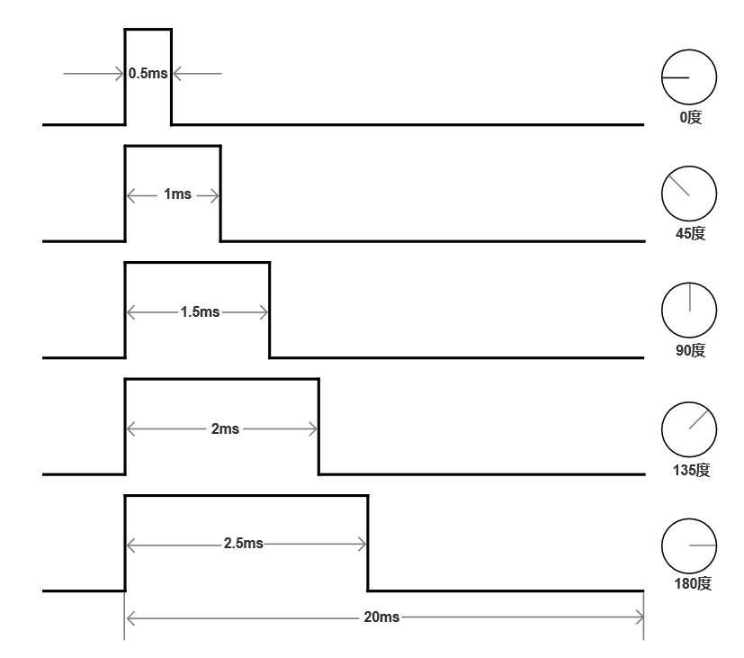

# Pin Settings

## LED灯

PC2-右上角灯-VLC_TX1: **IO19,**  UART1

PB0-左下角灯-VLC_TX2: **IO 39,**  UART2

## PD

PC10-VLC_RX1： **IO8,**  UART1

EXTRAPORT 2-VLC_RX2:	  **IO1,**  UART2

## 电机

**Timer:**  `LEDC_TIMER_0`

PA11-右轮-PWMA ：**IO16**
PA15-AN+ : **IO18**
PB5 -AN-:   **IO11**

PA8-左轮-PWMB ：**IO15**
PB4-BN+: **IO10**
PA12-BN-: **IO17**

## 舵机

**Timer:**  `LEDC_TIMER_1`

PC9-舵机： **IO7**

# Data Packet Structure

`Data packet structure: 0x1F (Header) + sequence number (1 byte) + data (VLC_PAYLOAD_LENGTH bytes) + 0XAA (Tail)`

# Project Documentation

## VLC_parameters

This header file is used to configure the global VLC driver parameters settings:

* `VLC_PAYLOAD_LENGTH`: The original data length, in bytes. i.e. "abcd" length is 4.
* `VLC_FRAME_LENGTH`: The frame data length (add 1 bytes PSN), in bytes. i.e. 1+"abdc" length is 5.
* `VLC_BAUD_RATE`: The transmitting bit rate.

## VLC_transmitter

The transmitter is based on the `uart`.  ESP32 S3 supports three different `uart` ports.

`UART 1` and `UART 2` is used for VLC.

`UART 0`is the default console logging port. Better not modify it.

## VLC_receiver

The receiver is also based on the `uart`. `gptimer` and `gpio_interrupt` is used to detect the header.

The detect logic is shown as below:

## Vehicle_motor

This component is used to control the motor. Currently, the controller is just simply fixed `PWM`

## Vehicle_servo

The PWM frequency is set to 20 ms. We can use 
The mapping between duty and angle is shown as below:

## FEC Scheme

I will not implement `FEC` on ESP32 because there is no correct implementation for embeded system. I will choose to use ESP32 to send data and decode them on my PC.

### Raptor Code

RFC documents: [RFC 5053 - Raptor Forward Error Correction Scheme for Object Delivery (ietf.org)](https://datatracker.ietf.org/doc/html/rfc5053)

Some implementation:

1. [OpenRQ (openrq-team.github.io)](https://openrq-team.github.io/openrq/)

    1. Java version. The wiki page is worth reading.
    2. [Where is error correction? · Issue #10 · openrq-team/OpenRQ (github.com)](https://github.com/openrq-team/OpenRQ/issues/10)

        1. This answer about why raptor codes can't corret intra-symbol error is good.
2. [obolo/freeRaptor: A free and open implementation of Raptor codes (github.com)](https://github.com/obolo/freeRaptor)

    1. The decoder implementation is wrong. :(
3. [LucaFulchir/libRaptorQ: RaptorQ RFC6330 C++11 implementation (github.com)](https://github.com/LucaFulchir/libRaptorQ)

    1. Cpp version. I choose this one.

### Reed-Soloman Code

1. [reedsolomon-c/rs.c at master · jannson/reedsolomon-c (github.com)](https://github.com/jannson/reedsolomon-c/blob/master/rs.c)

### Spinal Code

My version or john perry's version.
